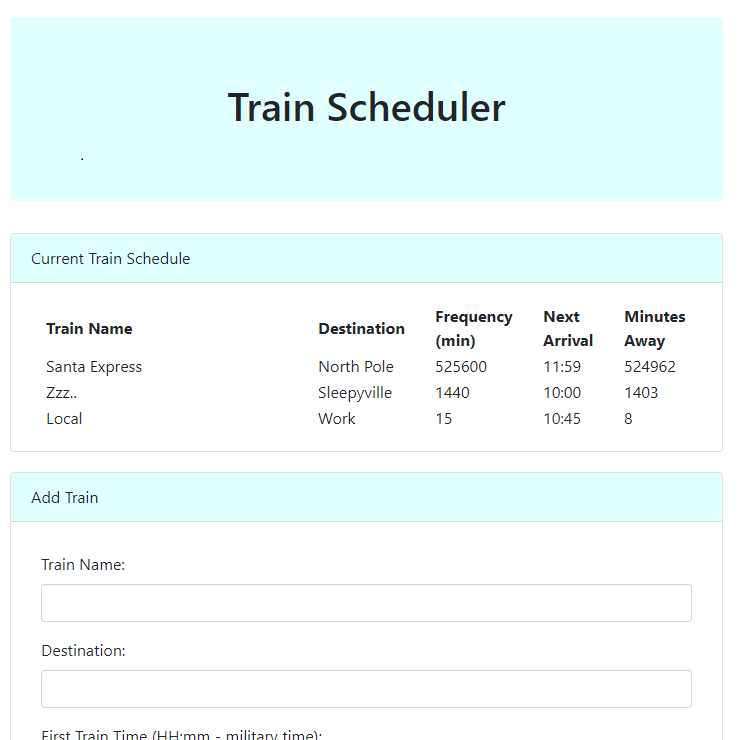

# Train Scheduler

## Link to deployed app: [https://plsenh.github.io/Train-Scheduler/](https://plsenh.github.io/Train-Scheduler/)

---

## Overview:

App to add and view information on scheduled trains. Add trains to the schedule and see the next arrival time and how may minutes away they are.

## How to Use:

**View train schedule**

Using the sample data from above image, the Local train arrives every 15 minutes and the next arrival is 10:45 AM and it is 8 minutes away.

**Adding a train:**

1. Enter the train name.
2. Enter destination name.
3. Enter time of the first train in miltary time using a HH:mm format (i.e. 22:30 instead of 10:30 PM).
4. Enter the arrival frequency in minutes.
5. Hit submit and see when the next train will arrive on the updated schedule.

---

## Technical Details:

User input is uploaded to and persisted by an associated Firebase database. Train information and calculated times are updated when the page is refreshed and when trains are added to the schedule.

## Built with:

- [Bootstrap](https://getbootstrap.com/) - Front-end component library for developing with HTML, CSS, and JS.
- CSS3
- [Firebase](https://firebase.google.com/) - Mobile and web application development platform with database functionality.
- HTML5
- [JavaScript](https://developer.mozilla.org/en-US/docs/Web/JavaScript) - High-level programming language.
- [jQuery](https://jquery.com/) - JavaScript library.
- [Moment.js](https://momentjs.com/) - Parse, validate, manipulate, and display dates and times in JavaScript.
- [Visual Studio Code](https://code.visualstudio.com/) - source code editor developed by Microsoft.

---

## Author:

- **Pauline Senh** - [plsenh](https://github.com/plsenh)
